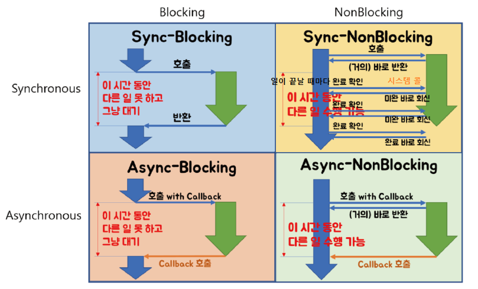

# 2022년 8월
## 8월 22일 - TIL 블로그 세팅 완료
>TIL 블로그 세팅 완료

## 8월 24일 - 부하 테스트
### 부하 테스트
- 각 시스템의 응답 성능 및 한계치를 알 수 있음
- 부하가 많이 발생할 때 나타나는 증상을 확인하고 성능을 개선 할 수 있음
- 서비스가 확장성을 가졌는지 확인할 수 있음

### 스모크 테스트

> 1. 최소 부하 상태에서 시스템에 오류가 발생하지 않는지 확인할 수 있음
> 2. VUser를 1~2로 구성하여 테스트

### 로드 테스트

> 1. 서비스의 평소 트래픽과 최대 트래픽 상황에서 성능이 어떤지 확인.(기능이 정상 동작 되는지)
> 2. 애플리케이션 배포 및 인프라 변경(scale out, DB failover 등)시에 성능 변화 확인
> 3. 외부 요인(결재 등)에 따른 예외 상황을 확인

### 스트레스 테스트

> 1. 서비스가 극한의 상황에서 어떻게 동작하는지 확인
> 2. 장기간 부하 발생에 대한 한계치를 확인하고 기능이 정상 동작하는지 확인
> 3. 최대 사용자 또는 최대 처리량을 확인
> 4. 스트레스 테스트 이후 시스템이 수동 개입없이 복구되는지 확인

## 8월 25일 - 암호화 AES-256과 SHA-256의 차이
### 뒤에 숫자의 의미
- AES-128, AES-192, AES-256이 있는데 뒤에 숫자는 암호에 사용되는 비트를 가르키고 당연히 256bit가 가장 안전한 방법이다.

### AES-256의 특징(양방향 개인키 블록 암호화 방식)
1. 암호화와 복호화 처리에 동일한 키를 사용하는 `대칭키`이다.
2. 비트 단위 암호화로 상대적으로 빠른 속도를 제공한다.
3. 구현이 용이하고 변형이 가능하지만 쉽게 해독이 가능하고 키관리가 어렵다.
### SHA-256의 특징(단방향 해쉬 암호화 방식)
1. 암호화와 복호화 처리에 서로 다른 키를 사용하는 `비대칭키`이다.
2. 큰 소수를 찾거나 곡률 방정식 등의 연산으로 속도가 느리다.
3. 단방향 암호화이기 때문에 복호화가 불가능하다.

## 8월 26일 - HTTP 헤더 구조
```http request
Get /test/test.html HTTP/1.1
Accept: */*
Accept-Language: ko
Accept-Encoding: gzip, deflate
If-Modified-Since: Fri, 21 Jul 2006 05:31:13 GMT
If-None-Match: "734237e186acc61:a1b"
User-Agent: Mozilla/4.0(compatible; MSIE 6.0; Windows NT 5.1; SV1; .NET CLR 1.1.4322; InfoPath.1)
Host: localhost
Connection: Keep-Alive

HTTP/1.1 200 OK
Server: Microsoft-IIS/5.1
X-Powered-By: ASP.NET
Date: Fri, 21 Jul 2006 05:32:01 GMT
Content-Type: text/htmlAccept-Ranges: bytes
Last-Modified: Fri, 21 Jul 2006 05:31:52 GMT
ETag: "689cb7f885acc61:a1b"
Content-Length: 101
```

### 요청헤더
1. GET /test/test.html HTTP/1.1
   - 요청 method와 요청 파일정보, http 버전
2. Accept
   - 클라이언트가 허용할 수 있는 파일 형식(MIME TYPE)으로 */*은 특정 유형이 아닌 모든 파일형식을 지원한다는 의미
3. User-Agent
   - 클라이언트 소프트웨어(브라우저, os 등)의 이름과 버전
4. Host
   - 요청을 한 서버의 Host
5. If-Modified-Since
   - 페이지가 수정되었으면 최신 버전 페이지 요청을 위한 필드
   - 만일 요청한 파일이 이 필드에 지정된 시간 이후로 변경되지 않았다면, 서버로부터 데이터를 전송받지 않는다. 이 경우 서버로부터 notmodified(304) 상태코드를 전송받게 된다.
```http request
HTTP/1.1 304 Not Modified
Server: Microsoft-IIS/5.1Date: Fri, 21 Jul 2006 06:23:04 GMT
X-Powered-By: ASP.NET
ETag: "689cb7f886acc61:a1b"
Content-Length: 0
```
6. Refer
   - 특정 페이지에서 링크를 클릭하여 요청을 하였을 경우에 나타나는 필드로써 링크를 제공한 페이지를 나타냅니다.
7. Cookie
   - 웹서버가 클라이언트에 쿠키를 저장해 놓았다면 해당 쿠키의 정보를 이름-값 쌍으로 웹서버에 전송
8. Accept-Language
   - 클라이언트가 인식할 수 있는 언어로 우선 순위 지정이 가능
9. Accept-Encoding
   - 클라이언트가 인식할 수 있는 인코딩방법으로 위의 내용에서는 서버에서 gzip, deflate로 압축한 리소스를 클라이언트가 해석
   - 서버에서 압축을 했다면 응답헤더에 Content-Encoding 헤더에 해당 압축 방법이 명시
### 응답 헤더
```http request
HTTP/1.1 200 OK
Server: Microsoft-IIS/5.1
X-Powered-By: ASP.NETDate: Fri, 21 Jul 2006 05:32:01 GMT
Content-Type: text/html
Accept-Ranges: bytes
Last-Modified: Fri, 21 Jul 2006 05:31:52 GMT
ETag: "689cb7f886acc61:a1b"
Content-Length: 101
```
1. HTTP/1.1 200 OK
   - HTTP 버전과 응답 코드(200 성공)
2. Server
   - 웹서버 정보
3. Date
   - 현재 날짜
4. Content-Type
   - 요청한 파일의 MIME 타입을 나타냅니다. Text/html은 Text 중 html 파일임을 나타냅니다.
5. Last-Modified
   - 요청한 파일의 최종 수정일
6. Content-Length
   - 요청한 파일의 데이터의 길이(바이트 단위)
7. ETag
   - 캐쉬 업데이트 정보를 위한 임의의 식별 숫자
## 8월 27일 - 요청 method
> 클라이언트가 웹 서버에게 사용자 요청의 목적이나 종류를 알리는 수단. 주요 메서드 GET/POST/PUT/DELETE와 기타 메소드 HEAD/OPTIONS/CONNECT/TRACE로 나뉘어 정리 할 수 있다.
### GET 
- URI(URL)이 가진 정보를 검색하기 위해 서버측에 요청하는 형태. 보통 리소스를 조회할 때 사용하며, 서버에 전달하고 싶은 데이터는 query를 통해서 전달한다. 메시지 바디를 사용해서 데이터를 전달할 수는 있지만, 지원하지 않는 곳이 많아서 권장하지 않는다.
### POST
- 데이터 요청을 처리하고, 메시지 바디를 통해 서버로 데이터를 전달한다. 요청 URI(URL)에 양식 입력을 처리하기 위해 구성한 서버측 스크립트(ASP, PHP, JSP 등) 혹은 CGI 프로그램으로 구성되고 Form Action과 함께 전송되는데, 이 때 헤더 정보에 포함되지 않고 데이터 부분에 요청 정보가 들어가게 된다.
### PUT
- 리소스가 있으면 대체하고 리소스가 없으면 생성한다. POST 처럼 정보를 서버로 제출하는 것이지만 덮어쓴다고 보면 쉽다.
### DELETE 
- 웹 리소스를 제거할 때 사용한다. 실제로 삭제되지 않았지만, 클라이언트는 삭제 되었다고 생각될 수 있다.
### HEAD
- HEAD 요청 방식은 GET과 유사한 방식이나 웹 서버에서 헤더 정보 이외에는 어떤 데이터도 보내지 않는다. 웹 서버의 다운 여부 점검(Health Check)이나 웹 서버 정보(버전 등)등을 얻기 위해 사용될 수 있다.
### OPTIONS
- 해당 메소드를 통해 시스템에서 지원되는 메소드 종류를 확인할 수 있다.
### CONNECT
- 웹 서버에 프록시 기능을 요청할 때 사용된다.
### TRACE
- 원격지 서버에 Loopback 메세지를 호출하기 위해 사용된다.

## 8월 29일 - 동기&비동기 vs 블로킹&논블록킹 개념 차이
> `동기와 비동기`는 프로세스의 수행 순서 보장에 대한 매커니즘이고 `블록킹과 논블록킹`은 프로세스의 유휴 상태에 대한 개념으로 완전한 별개의 개념임.

### 동기 & 비동기
> 호출되는 함수의 작업 완료 여부를 신경쓰냐에 따라, 함수 실행/리턴 순차적인 흐름을 따르느냐, 안따르냐가 관심사
> 1. 동기
>    - A가 함수 B를 호출한 뒤, 함수 B의 작업 완료 여부를 계속 확인 하면서 신경쓰는 것
> 2. 비동기
>    - A가 함수 B를 호출한 뒤, 함수 B의 작업 완료 여부를 신경쓰지 않는 것

### 블로킹 & 논블로킹
> 처리되어야 하는 (하나의) 작업이, 전체적인 작업 '흐름'을 막느냐 안막느냐에 대한 관점
> 제어권이 누구한테 있느냐가 관심사
> 1. 블로킹
>    - A 함수가 B 함수를 호출하면, 제어권을 A가 호출한 B 함수에 넘겨준다.
> 2. 논블로킹
>    - A 함수가 B 함수를 호출해도 제어권은 그대로 자신이 가지고 있는다.

- 동기&비동기는 블로킹&논블로킹과 별개의 개념이기 때문에 다음과 같이 혼합해서 사용이 가능하다.


## 8월 30일 - 스프링 캐시 추상화
> 스프링은 AOP 방식으로 편리하게 메소드에 캐시 서비스를 적용하는 기능을 제공하고 있다. 캐시 서비스는 트랜잭션과 마찬가지로 `AOP를 이용해 메소드 실행 과정에 투명하게 적용`된다.

### @Cacheable
```java
  // 캐시 저장 (Key를 지정한 경우)
  @Cacheable(value = "memberCacheStore", key = "#member.name")
  public Member cacheableByKey(Member member) {
    System.out.println("cacheableByKey 실행");
    ...
    return member;
  }

  // 조건부 캐시 저장 (With Condition)
  @Cacheable(value = "memberCacheStore", key = "#member.name", condition = "#member.name.length() > 5")
  public Member cacheableWithCondition(Member member) {
    System.out.println("cacheableWithCondition 실행");
    ...
    return member;
  }
```
- 캐시 읽기 및 저장
  - member 객체에 name을 처음 사용했을때 캐시에 해당 값이 저장된다. 다시 같은 값의 name을 요청 할때는 객체를 새로 불러 오지 않고 캐싱된 객체를 불러온다.
- 조건부 캐시 저장
  - condition = "#member.name.length() > 5" 옵션은 member 객체의 name 필드 값의 길이가 5를 초과하는 경우에만 캐싱되도록 한 것
### @CachePut
```java
  @CachePut(value = "memberCacheStore", key = "#member.name")
  public Member cachePut(Member member) {
    System.out.println("cachePut 실행");
    ...
    return member;
  }
```
- 캐시 저장
  - 캐시를 불러오지 않고 새로운 값을 계속 갱신하면서 캐시로 저장한다.
### @CacheEvict
```java
  // name 키 값을 가진 캐시만 제거
  @CacheEvict(value = "memberCacheStore", key = "#member.name")
  public Member cacheEvictByKey(Member member) {
    System.out.println("cacheEvictByKey 실행");
    ...
    return member;
  }

  // 캐시에 저장된 값을 모두 제거할 필요가 있을 때
  @CacheEvict(value = "memberCacheStore", allEntries = true)
  public Member cacheEvictAllEntries() {
    System.out.println("cacheEvictAllEntries 실행");
    ...
    return null;
  }

  // beforeInvocation 속성으로 메서드 실행 이후(기본값)나 이전에 제거를 해야하는지 지정할 수 있다.
  @CacheEvict(value = "memberCacheStore", beforeInvocation = true)
  public Member cacheEvictBeforeInvocation() {
    System.out.println("cacheEvictBeforeInvocation 실행");
    ...
    return null;
  }
```
- 캐시 제거
  - 캐싱 된 키값을 기준으로 캐시를 제거한다.
- allEntries 속성
  - allEntreis 옵션의 경우 캐시에 저장된 값을 모두 제거할 필요가 있을 때 사용하는 옵션
- beforeInvocation 속성
  - 메서드 실행 이전에 제거되는 경우(beforeInvocation = true)에는 메서드가 호출되기 전에 캐싱된 데이터가 항상 제거되기 때문에 제거가 메서드 결과에 의존하지 않는 경우에 유용

## 8월 31일 - 리눅스 OS, 쉘, 터미널, 커널
### 커널
- 운영체제의 90%를 차지하며 하드웨어와 응용 프로그램 사이에서 인터페이스를 제공하여 컴퓨터의 하드웨어를 제어 한다.
- 소프트웨어로부터 요청을 하드웨어가 처리할 수 있도록 컴파일 해준다고 보면 된다.
### 쉘
- 실제로 명령어를 전달하고 결과를 전달받는 프로그램
- 윈도의 cmd, linux/unix의 bash 가 대표적인 예이다. 이외에도 sh,csh
### 터미널
- 서버의 로컬 또는 원격으로 접속할 수 있는 콘솔을 구현한 소프트웨어
### 콘솔
- 콘솔 = 물리적 터미널
- 콘솔이 물리적인 장치라면 터미널은 원격제어 환경까지 포함하는 더 넓은 의미