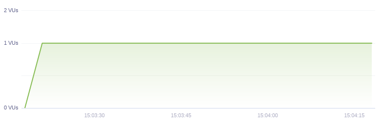
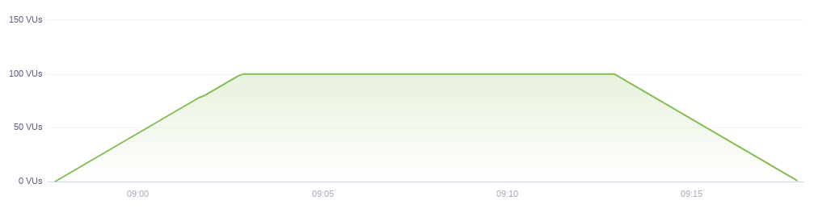
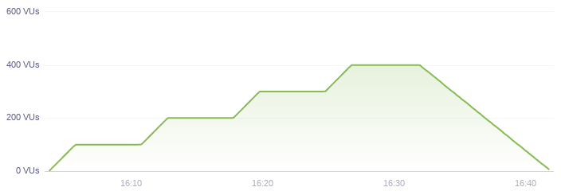

# 2022년 8월
## 8월 22일 - TIL 블로그 세팅 완료
>TIL 블로그 세팅 완료

## 8월 24일 - 부하 테스트
### 부하 테스트
- 각 시스템의 응답 성능 및 한계치를 알 수 있음
- 부하가 많이 발생할 때 나타나는 증상을 확인하고 성능을 개선 할 수 있음
- 서비스가 확장성을 가졌는지 확인할 수 있음

### 스모크 테스트

> 1. 최소 부하 상태에서 시스템에 오류가 발생하지 않는지 확인할 수 있음
> 2. VUser를 1~2로 구성하여 테스트

### 로드 테스트

> 1. 서비스의 평소 트래픽과 최대 트래픽 상황에서 성능이 어떤지 확인.(기능이 정상 동작 되는지)
> 2. 애플리케이션 배포 및 인프라 변경(scale out, DB failover 등)시에 성능 변화 확인
> 3. 외부 요인(결재 등)에 따른 예외 상황을 확인

### 스트레스 테스트

> 1. 서비스가 극한의 상황에서 어떻게 동작하는지 확인
> 2. 장기간 부하 발생에 대한 한계치를 확인하고 기능이 정상 동작하는지 확인
> 3. 최대 사용자 또는 최대 처리량을 확인
> 4. 스트레스 테스트 이후 시스템이 수동 개입없이 복구되는지 확인

## 8월 25일 - 암호화 AES-256과 SHA-256의 차이
### 뒤에 숫자의 의미
- AES-128, AES-192, AES-256이 있는데 뒤에 숫자는 암호에 사용되는 비트를 가르키고 당연히 256bit가 가장 안전한 방법이다.

### AES-256의 특징(양방향 개인키 블록 암호화 방식)
1. 암호화와 복호화 처리에 동일한 키를 사용하는 `대칭키`이다.
2. 비트 단위 암호화로 상대적으로 빠른 속도를 제공한다.
3. 구현이 용이하고 변형이 가능하지만 쉽게 해독이 가능하고 키관리가 어렵다.
### SHA-256의 특징(단방향 해쉬 암호화 방식)
1. 암호화와 복호화 처리에 서로 다른 키를 사용하는 `비대칭키`이다.
2. 큰 소수를 찾거나 곡률 방정식 등의 연산으로 속도가 느리다.
3. 단방향 암호화이기 때문에 복호화가 불가능하다.
