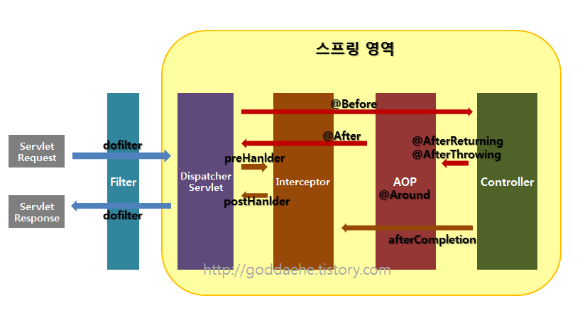

# 2022년 10월
## 10월 8일 - CQRS 패턴 ,변경 감지 방법
### Command and Query Responsibility Segregation
- 명령과 조회의 책임을 분리한다.
### CQRS가 필요한 시점
- UX와 비지니스 요구 사항이 복잡해질 때
- 조회 성능을 보다 높이고 싶을 때
- 데이터를 관리하는 영역과 이를 뷰로 전달하는 영역의 책임이 나뉘어져야 할 때
- 시스템 확장성을 높이고 싶을 때
### 변경 감지 방법 (내려갈수록 추상화레벨이 낮아짐.)
1. JPA EntityListensers
   1. @Entity 혹은 @MappedSuperclass 객체 메소드에 어노테이션 지정으로 사용 가능
   2. 7개의 Callback 지정 함수 선언 가능 - Entity 생명주기에서 어느시점에서든 Callback 받을수 있음
   3. 해당 엔티티만 인자로 반환되기 때문에 구체적인 추적 불가
2. Hibernate EventListener
   1. SessionFacoryImpl -> SessionFactoryServiceRegistry -> EventListenerRegistry
   2. 26가지 디테일한 상황에 콜백
   3. 받고자 하는 상황에 따른 인터페이스를 구현한 클래스 등록
   4. 보다 상세한 정보 전달 (변경된 프로퍼티, 이전 상태, 현재 상태 등)
   5. 모든 엔티티 변경 사항이 전달 됨
3. Hibernate Interceptor
   1. Session 혹은 SessionFactory에 Interceptor 등록 가능
   2. EventListener에 비해 적은 콜백 종류
   3. 저장될 데이터 조작 가능
4. Spring AOP
   1. Method에만 설정 가능
   2. Method 실행 전/후, 반환 후, 예외 상황, 어노테이션 붙은 경우 등
   3. Pointcut 문법으로 동작
   4. 특정 케이스에만 적용 하자

## 10월 9일 - connectTimeout과 socketTimeout
- Socket Connect 시 타임아웃(connectTimeout): Socket.connect(SocketAddress endpoint, int timeout) 메서드를 위한 제한 시간
- Socket Read/Write의 타임아웃(socketTimeout): Socket.setSoTimeout(int timeout) 메서드를 위한 제한 시간

## 10월 14일 - IoC, DI, DIP 개념 잡기

### Inversion of Control (IoC, 제어의 역전)
코드의 흐름을 제어하는 주체가 바뀌는 것.
### Dependency Inversion principle (DIP, 의존관계 역전 법칙)
구체 클래스가 아닌 추상화를 의존하게 하여 변경에 유연하게 하자.
### Dependency Injection (DI, 의존성 주입)
필요로 하는 오브젝트를 스스로 생성하는 것이 아닌 외부로 부터 주입받는 기법(생성주입, 세터주입, 필드 주입)

## 10월 22일 - Spring batch Tasklet방식과 Chunk방식의 차이점
- step에서 tasklet 방식으로 구성하는 방법과 ItemReader/ItemProcessor/ItemWriter 단위로 청크 지향 프로세싱을 구성하는 방법이 있다.

### Tasklet 방식
- 단계 내에서 단일 태스크를 수행하기 위한 것으로 임의의 Step을 실행할 때 읽기/처리/쓰기를 하나의 작업으로 처리하는 방식
- 배치 처리 과정이 비교적 쉬운 경우 쉽게 사용
- 대량 처리를 하는 경우 더 복잡
- 하나의 큰 덩어리를 여러 덩어리로 나누어 처리하기 부적합

### Chunk 방식
- 트랜잭션 경계 내에서 청크 단위(아이템이 트랜잭션에서 커밋되는 수)로 데이터를 읽고 생성하는 기법
- ItemReader, ItemProcessor, ItemWriter의 관계 이해 필요
- 대량 처리를 하는 경우 Tasklet 보다 비교적 쉽게 구현
- 예를 들면 10,000개의 데이터 중 1,000개씩 10개의 덩어리로 수행

## 10월 23일 - 스프링프레임워크와 스프링부트의 차이점 
### Spring Boot Starter
- 기존에는 스프링을 사용할 때 버전까지 명시하고 버전에 맞는 설정을 하였지만, 스프링 부트는 버전 관리를 스프링 부트에 의해서 관리됩니다. 따라서 아래처럼 spring-boot-starter-web을 사용하면 종속된 모든 라이브러리를 알맞게 찾아서 함께 가져오기 때문에 종속성이나 호환 버전에 대해 신경 쓸 필요가 없게 됨.
### Embed Tomcat
- 스프링 부트는 내장형 톰캣을 가지고 있기 때문에 별도의 톰캣을 설정할 필요가 없어졌으며, 그렇기 때문에 독립적으로 실행 가능한 jar로 손쉽게 배포가 가능
### AutoConfigurator
- 공통적으로 필요한 DispatcherServlet같은 설정을 어노테이션을 이용하여 대신할 수 있도록 해준다.
- 스프링 부트의 main 메서드는 @SpringBootApplication 어노테이션을 가지고 있는데 이것은 ComponentScan + configuraion + EnableAutoConfiguration를 합친 어노테이션 이라볼 수 있다.

## 10월 31일 - filter, interceptor, AOP의 차이점
자바 웹 개발을 하다보면 공통 관심사를 분리해야될 시점이 생기는데 이때 보통 filter,interceptor,AOP를 사용한다. 이 세가지의 차이점을 알아보자.
### Filter, Interceptor, AOP의 흐름
Filter → Interceptor → AOP → Interceptor → Filter
1. 서버를 실행시켜 서블릿이 올라오는 동안에 init이 실행되고, 그 후 doFilter가 실행된다.
2. 컨트롤러에 들어가기 전 preHandler가 실행된다
3. 컨트롤러에서 나와 postHandler, after Completion, doFilter 순으로 진행이 된다.
4. 서블릿 종료 시 destroy가 실행된다.

### 필터(Filter)란?
- 말그대로 요청과 응답을 거른뒤 정제하는 역할을 한다.
- 서블릿 필터는 DispatcherServlet 이전에 실행이 되는데 필터가 동작하도록 지정된 자원의 앞단에서 요청내용을 변경하거나, 여러가지 체크를 수행할 수 있다.
- 또한 자원의 처리가 끝난 후 응답내용에 대해서도 변경하는 처리를 할 수가 있다.
- 보통 web.xml에 등록하고, 일반적으로 인코딩 변환 처리, XSS방어 등의 요청에 대한 처리로 사용된다.
- springsecurity에서 filter를 이용하여 인증 인가 부분을 쉽게 구축한다.

### 필터(Filter)의 용도 및 예시
- 공통된 보안 및 인증/인가 관련 작업
- 모든 요청에 대한 로깅 또는 감사
- 이미지/데이터 압축 및 문자열 인코딩
- Spring과 분리되어야 하는 기능

### Interceptor
- 요청에 대한 작업 전/후로 가로챈다고 보면 된다.
- 필터는 스프링 컨텍스트 외부에 존재하여 스프링과 무관한 자원에 대해 동작한다.
- 하지만 인터셉터는 스프링의 DistpatcherServlet이 컨트롤러를 호출하기 전, 후로 끼어들기 때문에 스프링 컨텍스트(Context, 영역) 내부에서 Controller(Handler)에 관한 요청과 응답에 대해 처리한다.
- 스프링의 모든 빈 객체에 접근할 수 있다.
- 인터셉터는 여러 개를 사용할 수 있고 로그인 체크, 권한체크, 프로그램 실행시간 계산작업 로그확인 등의 업무처리

### 인터셉터(Interceptor)의 용도 및 예시
- 세부적인 보안 및 인증/인가 공통 작업
- API 호출에 대한 로깅 또는 감사
- Controller로 넘겨주는 정보(데이터)의 가공

### AOP
- OOP를 보완하기 위해 나온 개념 
- 객체 지향의 프로그래밍을 했을 때 중복을 줄일 수 없는 부분을 줄이기 위해 종단면(관점)에서 바라보고 처리한다.
- 주로 '로깅', '트랜잭션', '에러 처리'등 비즈니스단의 메서드에서 조금 더 세밀하게 조정하고 싶을 때 사용합니다.
- Interceptor나 Filter와는 달리 메소드 전후의 지점에 자유롭게 설정이 가능하다.
- Interceptor와 Filter는 주소로 대상을 구분해서 걸러내야하는 반면, AOP는 주소, 파라미터, 애노테이션 등 다양한 방법으로 대상을 지정할 수 있다.
- AOP의 Advice와 HandlerInterceptor의 가장 큰 차이는 파라미터의 차이다.
- Advice의 경우 JoinPoint나 ProceedingJoinPoint 등을 활용해서 호출한다.
- 반면 HandlerInterceptor는 Filter와 유사하게 HttpServletRequest, HttpServletResponse를 파라미터로 사용한다.
