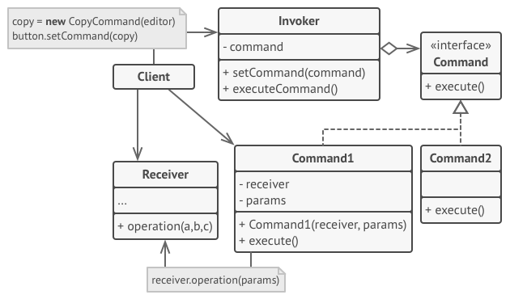

# Singleton 패턴
## 정의
- 싱글턴(singleton)은 오직 하나의 객체만을 생성할 수 있는 클래스를 말합니다. 따라서 싱글턴 패턴을 사용하면 쉽게 객체의 유일성을 보장할 수 있습니다.
- 또한 일반적으로 싱글턴 객체에 대한 참조를 public static 필드나 public static 메서드로 노출하므로 어디에서나 싱글턴 객체에 접근할 수 있습니다.
## 구현
### 싱글턴객체 기본 생성법
- public static final을 이용하여 외부에서 자유롭게 접근이 가능하지만 이 필드에 다른 객체가 할당되거나, 이미 할당했는데 싱글턴 내부에서 다시 객체를 할당하는 실수가 없도록 해야됨.
- 그리고 외부에서 생성자를 통해 객체를 생성할 수 없도록 생성자 접근을 private으로 제한
```java
public class Singleton {
public static final Singleton INSTANCE = new Singleton();

	private Singleton() { }
 
	...
}

// 혹은 ...
public class Singleton {
private static final Singleton INSTANCE = new Singleton();

	private Singleton() { }
 
	public static Singleton getInstance() {
		return INSTANCE;
	}
 
	...
}
```

- 다음과 같이 정적필드로 접근 가능

```java
// 생성자의 접근 범위가 private이기 때문에 생성자로는 객체를 생성할 수 없다.
// Singleton obj = new Singleton(); (X)
 
// INSTANCE는 final로 선언되었기 때문에 외부에서 다시 지정하는 것은 불가능하다.
// Singleton.INSTANCE = null; (X)
 
// 외부에서 정적 필드로 다음과 같이 접근할 수 있다.
Singleton.INSTANCE.service();
 
// 혹은...
Singleton obj = Singleton.getInstance();
obj.service();
```
### 지연초기
- 싱글턴 인스턴스를 초기화할때 다음과 같이 지연초기화를 이용하여 처음 한번만 초기화 가능하게 할 수 있다.
```java
public class Singleton {  
    private static Singleton instance;  
  
    private Singleton() { }  
  
    public static Singleton getInstance() {  
        if (instance == null) {  
            instance = new Singleton();  
        }  
        return instance;  
    }  
}
```
- 멀티쓰레드 환경에서 원자성을 위배할 수 있기 때문에 synchronized를 붙여 한번의 하나의 스레드만 접근가능하도록 동기화 하어야 한다.
```java
public class Singleton {  
    private static Singleton instance;  
  
    private Singleton() { }  
  
    public static synchronized Singleton getInstance() {  
        if (instance == null) {  
            instance = new Singleton();  
        }  
        return instance;  
    }  
}
```
- 더블 체크 락킹을 이용하여 동기화 범위를 줄여 동기화 오버헤드를 줄일 수 있다. 여기서 중요한 점은 instance 필드에 값을 쓸 때 재배열이 일어나지 않도록 volatile로 선언하는 것입니다.
```java
public class Singleton {
	private static volatile Singleton instance;
  
    private Singleton() { }  
 
	// 코드가 다소 장황하지만 동기화 오버헤드를 피할 수 있으므로 성능 이점이 있다.
	public static Singleton getInstance() {
		if (instance == null) {
			// 동기화 블록은 한번에 하나의 스레드만 접근할 수 있다.
			synchronized (Singleton.class) {
				if (instance == null) {
					instance = new Singleton();
				}
			}
		}
		return instance;
	}
 
	...
}
```
- 요청 시 초기화 홀더 패턴을 이용하여 간단하게 구현할 수도 있다.
```java
public class Singleton {  
 
    private Singleton() { }
    
    private static final class Holder {  
        private static final Singleton INSTANCE = new Singleton();  
    }  
    
    public static Singleton getInstance() {  
        return Holder.INSTANCE;  
    }
 
	...
}
```
## 싱글턴의 단점
1. 테스트하기가 어렵다
- 테스트는 독립적, 즉 다른 테스트에 영향을 미치지 않아야 하는데 한 테스트에서 싱글턴 객체가 만들어지면 그 이후의 다른 테스트에서도 이를 확인할 수 있다.
- 또한 일반적으로 인터페이스가 아닌 클래스를 통해 구현되는 싱글턴은 목(mock)으로 대체할 수 없으므로 단위 테스트를 매우 까다롭게 만든다.
- 이를 해결하기 위해서 주로 의존관계 주입(dependency injection, 이하 DI)을 사용할 수 있으며 이때는 보통 DI 프레임워크가 싱글턴 객체의 생성을 제어한다.
2. 데이터 경쟁이 일어나기 쉽다
- 싱글턴이 상태를 가지고 있다면 상황이 더 복잡해지며, 멀티 스레드 환경에서는 공유 변수 접근 시 적절하게 동기화가 이루어지지 않았다면 경쟁 상태(race condition)가 문제가 될 수 있으므로 주의해야 합니다.
3. 변경에 취약해진다

# Command 패턴
커맨드 패턴(Command pattern)은 객체가 특정 기능을 바로 수행하거나 나중에 트리거할 때 필요한 모든 정보를 캡슐화하는 행동 패턴이다. 
이렇게 하면, 나중에 순서대로 실행하기 위한 명령 목록을 구성하거나 되돌리기가 가능한 명령을 만드는 등이 가능하다. 커맨드 패턴이 캡슐화하는 정보는 다음과 같다.

- 메서드명
- 메서드를 소유하는 객체
- 메서드 인자(parameter)

## Command 패턴의 구성

Invoker 클래스는 Command 인터페이스를 가진 객체의 execute() 메서드를 호출한다. 
사실 이는 ConcreteCommand 클래스의 객체로, execute() 메서드는 실제 작업을 하는 Receiver 클래스의 객체를 호출한다.

- Invoker: 명령이 들어 있으며, execute() 메서드를 호출함으로써 ConcreteCommand 객체에게 특정 작업의 수행을 요청한다.
- Receiver: 요구 사항을 수행하기 위해 어떤 일을 처리해야 하는지 알고 있는 객체다.
- Command: 연산을 수행할 인터페이스를 정의한다. 모든 커맨드 객체는 이 인터페이스를 구현해야 하며, 모든 명령은 execute() 메서드 호출을 통해 수행된다. 이 메서드에서는 Receiver에 특정 작업을 처리하라는 지시를 전달한다.
- ConcreteCommand: 이 클래스는 Command 인터페이스를 확장하고, execute() 메서드를 구현함으로써 Receiver에 있는 메서드를 호출하여 요청된 작업을 수행한다.

## Command 패턴의 장점
- 작업을 요청하는 클래스와 실제로 작업을 수행하는 클래스를 분리한다.
- 기존 코드를 수정하지 않고 새로운 커맨드를 쉽게 추가할 수 있다.
- 정보 시스템의 일반적인 특성은 트랜잭션(transaction)을 처리해야 한다는 것이다. 트랜잭션은 일련의 과정을 통해 데이터를 변경하는 것인데, 커맨드 패턴은 이런 트랜잭션의 모델링을 가능하게 한다

## Command 패턴의 단점
- 모든 작업이 독립적인 ConcreteCommand 클래스이므로 구현 및 유지보수해야 하는 클래스가 많다.
- 단 하나의 커맨드에 대해 클래스가 많아진다.

# Strategy 패턴
객체들이 할 수 있는 행위 각각에 대해 전략 클래스를 생성하고, 유사한 행위들을 캡슐화 하는 인터페이스를 정의하여,
객체의 행위를 동적으로 바꾸고 싶은 경우 직접 행위를 수정하지 않고 전략을 바꿔주기만 함으로써 행위를 유연하게 확장하는 방법을 말합니다.

## 전략패턴과 커멘드 패턴의 차이점
### 전략패턴 예시
전략 패턴은 프로그램이 진행되면서 캡슐화된 로직을 선택할 수 있게 하는 디자인 패턴입니다. 로직 실행은 인터페이스에 의존을 시키고 인터페이스를 구현한 로직들을 전달해줌으로써 분기처리 없이 유연성을 갖출 수가 있습니다
```java
public class PeopleWithMovement {

    private Transportation transportation;

    public PeopleWithMovement(Transportation transportation) {
        this.transportation = transportation;
    }

    public void move(String start, String end) {
        transportation.move(start, end);
    }

    public void changeTransporation(Transportation transportation) {
        this.transportation = transportation;
    }
}
```
```java
public interface Transportation {

    void move(String start, String end);
}

public class Bicycle implements Transportation {

    @Override
    public void move(String start, String end){
        System.out.println("출발점 : " + start + "에서 목적지 : " + end + "까지 `자전거`로 이동합니다.");
    }
}

public class Bus implements Transportation {

    @Override
    public void move(String start, String end){
        System.out.println("출발점 : " + start + "에서 목적지 : " + end + "까지 `버스`로 이동합니다.");
    }
}
```
```java
public class Main {

    public static void main(String[] args) {
        Bicycle bicycle = new Bicycle();
        Bus bus = new Bus();

        PeopleWithMovement whybeFirst = new PeopleWithMovement(bicycle);
        whybeFirst.move("시작점", "끝점");

        PeopleWithMovement whybeSecond = new PeopleWithMovement(bus);
        whybeSecond.move("시작점", "끝점");

        PeopleWithMovement whybeChangeMovement = new PeopleWithMovement(bicycle);
        whybeChangeMovement.move("시작점", "중간지점");
        whybeChangeMovement.changeTransporation(bus);
        whybeChangeMovement.move("중간지점", "끝점");
    }
}
```
>- 출발점 : 시작점에서 목적지 : 끝점까지 `자전거`로 이동합니다.
>- 출발점 : 시작점에서 목적지 : 끝점까지 `버스`로 이동합니다.
>- 출발점 : 시작점에서 목적지 : 중간지점까지 `자전거`로 이동합니다.
>- 출발점 : 중간지점에서 목적지 : 끝점까지 `버스`로 이동합니다.


### 커멘드패턴 예시
```java
public class PeopleWithLottery {

    private List<LotteryCommand> lotteryCommands;

    public PeopleWithLottery(List<LotteryCommand> lotteryCommands) {
        this.lotteryCommands = lotteryCommands;
    }

    public void addLotteryCommand(LotteryCommand lotteryCommand) {
        lotteryCommands.add(lotteryCommand);
    }

    public void scratchAllLottery() {
        for (int i = 0; i < lotteryCommands.size(); i++) {
            LotteryCommand lotteryCommand = lotteryCommands.get(i);
            lotteryCommand.scratch();
        }
        //초기화
        lotteryCommands = new LinkedList<>();
    }
}

public interface LotteryCommand {
    void scratch();
}

public class InstantScratch implements LotteryCommand {
    
    private InstantLottery instantLottery;
    private account Account;

    public InstantScratch(InstantLottery instantLottery, Account account) {
        this.instantLottery = instantLottery;
        this.account = Account;
    }

    @Override
    public void scratch() {
      //instantLottery의 당첨을 확인하고 account에 돈을 집어 넣는 로직
    }
}

public class InstantLottery {
    
    private boolean win;

    public InstantLottery(boolean win) {
        this.win = win;
    }

    public boolean isWin() {
        return win;
    }
}

public class Account {

    private int balance;

    public void putMoney(int money) {
        balance += money;
    }
}

```
```java
public class Main {
    public static void main(String[] args) {
        PeopleWithLottery whybe = new PeopleWithLottery(new LinkedList<>());
        Account 와이비통장 = new Account();
        
        //즉석복권 구입
        for (int i = 0; i < 10; i++) {
            //즉석복권 생성 로직 
            InstantLottery instantLottery = new InstantLottery(당첨여부);
            //즉석복권긁기행위 객체 생성 및 커맨드 목록에 추가
            InstantScratch 즉석복권긁기커맨드 = new InstantScratch(즉석복권, 와이비통장);
            whybe.addLotteryCommand(즉석복권긁기커맨드);
        }
        
        whybe.scratchAllLotery();
    }
}

```

### 전략패턴과 커맨드패턴의 차이점
전략 패턴은 먼저 `어떻게` 라는 측면에 집중하게 됩니다. 하고자 하는 것은 이미 정해져 있고, 방법을 어떻게 할지에 대한 유연성을 고려하며 구현합니다. 인터페이스의 메소드에 직접적으로 의존을 하게 되어서, 해당 메소드의 parameter들에 강하게 영향을 받습니다. 이 때문에 위의 복권예시같은 로직을 수행하여 다른 인자가 필요하게 된다면 오버로딩을 해주어야하는데, 전략 패턴의 가치가 퇴색이 될 것입니다.

하지만 커맨드 패턴은 `무엇을` 초점을 두게 됩니다. 어떻게 할지에 대한 방법은 외부에서 정의하며 주입을 해주며, 그것을 실행하는 것이 중요하기 때문입니다. 그래서 즉석 복권 혹은 번호식 복권 중 무엇을 긁을지에 대해서 구현할 때에는 전략 패턴보다는 커맨드 패턴이 조금 더 적합하다고 볼 수가 있습니다. 

위의 예시에서는 커맨드 패턴은

1. 무엇을 할지를 선택하면 해당 행위를 하기 위한 필요한 변수들을 같이 캡슐화하여 제공받기 때문에 유연하다.
2. Receiver(Account)도 같이 제공을 받기 때문에 행위에 따른 영향을 받는 객체도 조건에 따라 다르게 설정할 수 있다.

의 장점을 알 수가 있습니다.

# State 패턴
# Adapter 패턴
# Proxy 패턴
# Facade 패턴
# Template Method 패턴
# Decorator 패턴
# Factory Method 패턴
# Abstract Factory 패턴
# Mediator 패턴
# Composite 패턴